# Top 10 Fleet Dash Cam Systems Ranked in 2025 (Fresh Compilation)

Managing commercial vehicles without real-time visibility feels like running a restaurant blindfolded—you know something's happening but have zero idea if it's good or catastrophic. Fleet dash cams with integrated GPS tracking have evolved from basic recording devices into AI-powered safety platforms that detect drowsy driving, automate driver coaching, and provide instant video evidence when accidents occur. Modern systems reduce collision-related costs by 80% or more while cutting false insurance claims that used to drain fleet budgets.

Whether you operate three delivery vans or 300 commercial trucks, these platforms eliminate the guesswork around driver behavior, vehicle location, and incident investigation. The best solutions combine high-definition cameras capturing road and driver footage with cloud-based software that turns raw video into actionable safety insights. Fleet managers gain live streaming access, automatic alerts for risky behaviors like cell phone use or harsh braking, and comprehensive reporting that makes coaching drivers easier than explaining why the office printer never works.

## **[SureCam](https://surecam.com)**

GPS-connected dash cams built specifically for commercial fleets prioritizing simplicity and results.

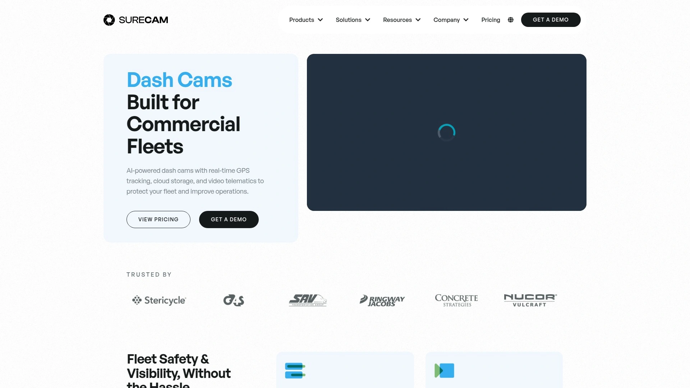

SureCam delivers AI-powered fleet dash cams that combine real-time video, GPS tracking, and driver coaching into a single easy-to-use platform designed for businesses that need protection without complexity. The system reduces alert volume by up to 90% through SureCam AI In-Cab Nudges, which help drivers self-correct risky behaviors in real time—you only get notified when situations actually require management attention. This intelligent filtering prevents the alert fatigue that plagues other camera systems where managers spend hours sorting through false positives.

**Complete visibility and automated operations:** Real-time GPS fleet tracking shows where every vehicle is at any moment, with instant video access from desktop or mobile devices. Live video streaming lets you see what's happening on the road right now, whether checking on a driver who called about a mechanical issue or investigating a customer complaint. Automatic Driver ID assigns trips to specific drivers without manual logging, ensuring accurate performance tracking and accountability across your entire fleet.

The platform generates driver safety scores based on actual road behavior rather than subjective manager opinions. These data-driven scores help you spot performance trends, recognize top performers for rewards or bonuses, and identify drivers who need focused coaching—all without digging through spreadsheets at 11 PM. Video telematics integration provides complete context around safety incidents by combining GPS data, vehicle diagnostics, and high-definition footage in single event reports.

SureCam offers multiple camera configurations including road-facing dash cams for fleets prioritizing driver privacy, dual-facing systems capturing both road and in-cab views, and front-rear setups providing complete incident documentation from every angle. Dual exterior cameras withstand harsh environments for operations in extreme weather or demanding job sites. All cameras connect seamlessly to the cloud platform, automatically uploading footage so you never lose critical evidence due to damaged equipment or driver tampering.

**Industry-specific adaptations:** SureCam tailors solutions for different business types—plumbing companies get different default alert thresholds than long-haul trucking fleets because their operational patterns differ significantly. Customer testimonials highlight tangible results: "Our claims losses reduced by over 80%. I used to get calls weekly. Now, I may get one call a month... With the cameras, it's pretty cut and dry. The answer is in the video". For fleet managers who want reliable video evidence, real-time insights, and driver coaching without unnecessary complexity, SureCam's focused approach delivers measurable safety improvements and cost savings.

## **[Samsara](https://www.samsara.com)**

Industry-leading AI dash cams integrated with comprehensive fleet management platform.

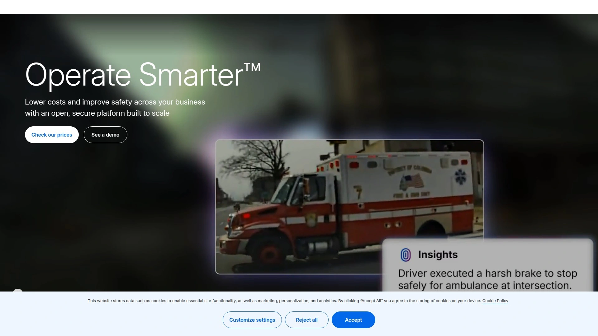

Samsara AI Dash Cams analyze road conditions and driver behavior continuously using real-time artificial intelligence. The cameras capture front-facing footage in 1440p high definition and driver-facing video at 1080p resolution, with front field-of-view at 129° and driver-facing at 167°. This hardware delivers clear evidence during incident investigations and provides training material for driver coaching sessions.

Industrial-grade VHB adhesive mounting keeps cameras securely positioned during heavy vibration or rough roads. HDR technology enhances visibility in bright sunlight and low-light conditions for front-facing footage, while infrared night vision captures clear in-cab video after dark. Multi-carrier 4G LTE connectivity with automatic fallback to 3G or Wi-Fi ensures footage uploads even in areas with spotty coverage. Local storage continues recording when offline, then syncs automatically once connection restores.

**Advanced safety features and coaching tools:** Preventative in-cab alerts warn drivers about potential hazards before incidents occur, giving them time to react and avoid collisions. The Driver App consolidates coaching, feedback, event review, and training in one mobile application, making it the most comprehensive platform for driver development. Fleet managers receive actionable insights identifying patterns across their entire operation rather than just reviewing individual incidents.

Samsara customers have saved an estimated $225 million by using dash cam footage to defend against false claims and not-at-fault accidents. Auto-uploaded HD incident footage, real-time fleet tracking, and on-demand video retrieval fully empower administrators to exonerate innocent drivers quickly. The platform's Camera Health Report provides real-time status monitoring on dash cam functionality, alerting you to technical issues before they cause gaps in coverage.

Privacy features include driver-facing video disable mode and visible recording LED indicators showing when cameras are actively capturing footage. Drivers can press a physical button to instantly save 30-second clips of notable events without involving dispatch. Video footage stores for 90 days in the cloud, supporting thorough crash investigations and providing evidence months after incidents occur. For fleets requiring enterprise-grade reliability with proven ROI, Samsara's complete platform handles safety, compliance, and operational efficiency through one integrated system.

## **[Lytx with Geotab](https://www.lytx.com)**

Unified video safety and telematics solution from two industry-leading companies.

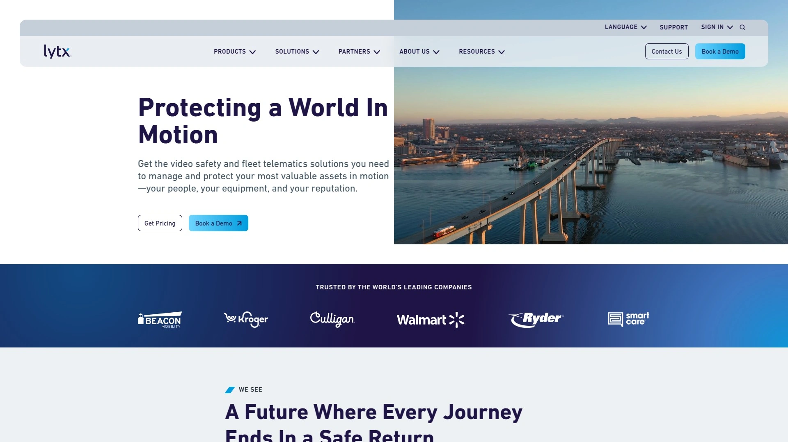

Lytx+ with Geotab launched in September 2025 as an all-in-one platform combining Lytx's video safety technology with Geotab's telematics into one seamless experience. This integration eliminates the complexity of managing separate systems—fleets get one contract, one installation, one user interface, one bill, and one driver app. The collaboration leverages over 50 combined years of expertise in data-driven fleet insights.

The solution delivers best-in-class video safety with real-time driver behavior monitoring, incident detection, and risk management integrated with advanced telematics covering fuel management, vehicle diagnostics, route optimization, and regulatory compliance including US ELD and IFTA. On-demand video retrieval and up to 400 hours of continuous footage accelerate claims processing and service verification. Market-leading vehicle compatibility supports over 9,000 vehicle years, makes, and models—including more than 300 electric vehicles.

**Comprehensive EV support and operational visibility:** The platform handles electric vehicle suitability assessments, battery health reporting, and sustainability metrics for fleets transitioning to EVs or managing mixed conventional-electric operations. Fully synchronized customizable data and reporting provide complete operational visibility across all fleet activities. For customers managing non-powered assets, the Geotab GO Anywhere device monitors trailers, containers, tools, and equipment location within the unified platform.

DriveCam event recorders capture dedicated footage validated by professional analysts, not just raw video dumps requiring hours of manual review. Lytx's proprietary machine vision and artificial intelligence cut through noise to deliver crucial insights backed by billions of miles of driving data. The combination of analytics, experience, and technology empowers fleets with both insights and video evidence for setting and achieving safety goals.

LandCare selected Lytx after evaluating seven dash cam providers and conducting proof-of-concept trials with three finalists. Their decision factors included event detection accuracy, user interface experience, reporting capabilities, and training resources—Lytx delivered strongest performance across all criteria. For fleets seeking a future-proof platform combining video safety and telematics from proven market leaders, Lytx+ with Geotab sets new industry standards.

## **[Verizon Connect](https://www.verizonconnect.com)**

AI dashcams with near-360-degree visibility integrated into enterprise fleet platform.

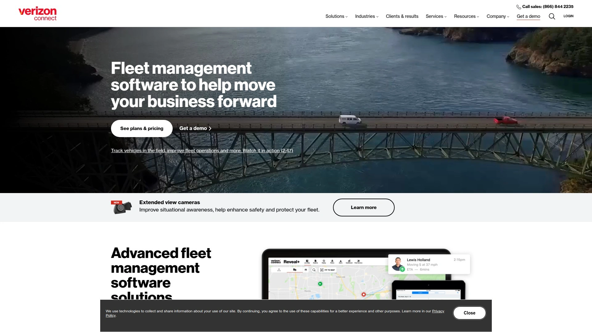

Verizon Connect debuted Extended View Cameras in January 2025, delivering near-360-degree visibility through coordinated rear, side, and cargo cameras. This comprehensive coverage eliminates blind spots that contribute to backing accidents, lane-change collisions, and cargo theft. Professional installation ensures proper camera positioning and secure mounting for all angles.

Both AI-powered camera types—road-focused and comprehensive multi-view systems—perform well in low light conditions and support live-view capabilities for real-time monitoring. HD video footage stores for 90 days to support crash investigations and dispute false insurance claims. When incidents occur outside 4G coverage areas, footage saves to internal dashcam memory and automatically uploads once connectivity restores.

**Route optimization and operational efficiency:** GPS fleet tracking integrates deeply with routing algorithms that calculate fastest paths accounting for real-time traffic, delivery windows, and vehicle capacity. Geofenced areas let you analyze fleet information for specific regions—identify which territories generate most stops, longest dwell times, or highest fuel consumption. The Integrated Video app connecting to dashcams is one of many Verizon Connect applications aimed at different user groups but all designed to improve midsize fleet operations.

Advanced dashcam setup captures views of driver, road, rear, and cargo area simultaneously, giving fleet managers complete context around incidents. Planned upgrades will add side-view cameras specifically for safer lane changes and extra protection against theft or tampering. The Driver Vehicle Inspection Report (DVIR) simplifies compliance and maintenance through the Reveal platform, reducing paperwork and ensuring regulatory requirements are met consistently.

Verizon Connect's solutions provide fleet managers with enhanced insights, streamlined operations, and regulatory support while helping improve safety and reduce liability. For enterprises managing large vehicle counts with complex reporting needs, Verizon Connect's comprehensive platform scales effectively.

## **[Motive](https://gomotive.com)**

AI dashcam with industry-leading accuracy and integrated fleet spend management.

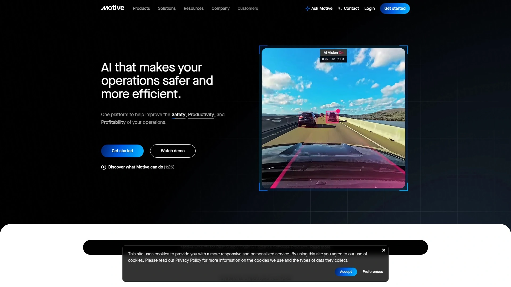

Motive AI Dashcam detects 15+ unsafe driving behaviors including cell phone usage, drowsiness, and close following with up to 99% accuracy. This precision stems from the platform's dedicated Safety Team—250 people who review every safety event and remove false positives before alerts reach managers. You save hours weekly by focusing only on safety events that genuinely matter rather than investigating dozens of questionable alerts.

Face Match technology identifies drivers with industry-leading accuracy, automatically assigning trips to the correct person and eliminating manual trip assignment. The system always shows who operated which vehicle, ensuring accountability and simplifying performance evaluations. Advanced hardware includes the Ambarella CV22 AI processor that simultaneously provides AI analysis and powerful image processing, resulting in enhanced video quality up to 1440 pixels.

**Fully integrated fleet card and spend management:** Motive Card represents the only platform offering natively integrated fleet card functionality. The comprehensive nationwide discount network delivers serious savings across fuel, maintenance, and other fleet expenses no matter where vehicles operate. Native integration with the broader Motive platform provides 360-degree visibility into drivers, vehicles, and fleet-related spend in one centralized location, eliminating data silos that force you to check multiple systems.

Customizable spend controls give finance teams complete authority over card usage. Set limits for individuals or groups by day and time, transaction amount, and product category—unauthorized spending stops before it happens rather than requiring reimbursement recovery. AI automatically surfaces suspicious transactions for investigation, reducing fraud and waste without manually reviewing every purchase.

The platform's combined approach addresses fleet management holistically rather than treating safety and operations as separate challenges requiring different vendors. For fleets prioritizing both driver safety and financial control through unified systems, Motive's integrated solution delivers comprehensive visibility.

## **[Netradyne](https://www.netradyne.com)**

AI-powered fleet cameras analyzing 100% of drive time for complete performance visibility.

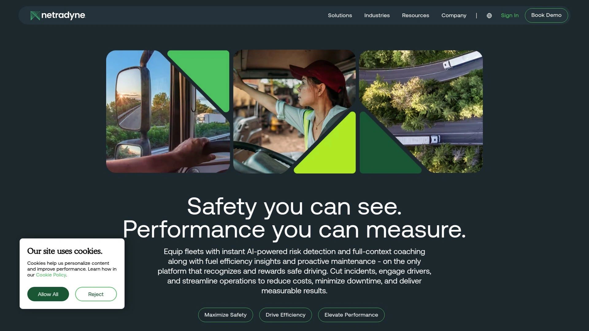

Netradyne's Driver- i system captures and analyzes 100% of driving time rather than only recording triggered events. This continuous monitoring provides complete accurate pictures of driver performance instead of fragmented incident-only views. The technology uses artificial intelligence, machine learning, and edge computing to enforce safe driving standards across entire fleets.

Four-camera configurations deliver 270-degree total in-vehicle field of view through 1080p road-facing, 1080p driver-facing, and two 720p side cameras mounted in a single windshield unit. All cameras capture video at 30fps with flexible driver-privacy options. The D-810 advanced platform supports up to eight AI-enabled cameras monitoring cab, trailer, and surrounding blind spots for full 360° coverage. Optional in-cab monitors provide live blind-spot views enhancing visibility during turns and reversing.

**Positive reinforcement and driver engagement:** Driver- i highlights safest driving events called DriverStars—each adds points to the driver's GreenZone score. The mobile app continually compares GreenZone scores to fleet averages and notifies drivers when they hit key milestones. This positive reinforcement system encourages good driving through recognition rather than only punishing mistakes. Fleet managers easily plan and execute driver reward programs using GreenZone scores as objective performance metrics.

Highly accurate AI recognizes objects including speed limit signs, traffic lights, stop signs, and pedestrians—providing context that basic cameras miss. This object recognition helps determine fault during incidents by verifying whether drivers followed traffic control devices. Automatic coaching delivers tailored suggestions explaining exactly how drivers can improve habits. Drivers self-coach by reviewing events and following recommendations to increase their scores.

Integration with myGeotab software combines best-in-class fleet operations and safety management through single interfaces. Real-time notifications of positive driving habits and best practices keep managers informed about what's going right, not just what's going wrong. For fleets seeking systems that engage drivers positively while providing complete operational visibility, Netradyne's approach balances accountability with recognition.

## **[GPS Trackit](https://gpstrackit.com)**

Cloud-based fleet solutions combining GPS tracking with multi-channel video telematics.

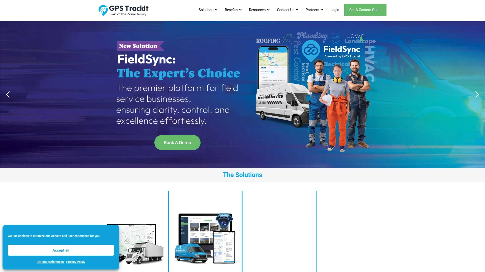

GPS Trackit has pioneered cloud-based IoT fleet solutions and GPS tracking with focus on comprehensive video capabilities. The VidFleet video telematics solution helps businesses exonerate drivers when accidents aren't their fault, provides context around vehicle utilization, and automates driver coaching to improve safety while reducing administrative burdens. This combination addresses both defensive protection and proactive improvement.

Multichannel video splitter records and transmits images from up to four HD cameras simultaneously back to the dashboard. This multi-angle coverage provides literal 360-degree views of driver behavior and vehicle events—far beyond the dual-camera setups most competitors offer. High-quality footage proves priceless during accident investigations and insurance claims, often determining liability within minutes rather than weeks.

**Real-time connectivity and operational tools:** Live traffic view through Google Maps integration shows vehicle locations overlaid on current traffic conditions. Turn-by-turn breadcrumb trails document exact routes traveled, useful for verifying service calls or investigating customer complaints about driver behavior. Customized email or text alerts notify managers immediately when predefined events occur—vehicles entering or leaving geofenced areas, excessive idling, harsh braking, or rapid acceleration.

Two-way messaging keeps managers connected with mobile workforces using pre-written messages for common situations. Drivers receive notifications for missed messages and new stops, ensuring important information never gets overlooked. Geofencing parameters trigger automatic alerts when vehicles enter or leave designated locations, simplifying compliance tracking for customer sites with time-window requirements.

Vehicles using GPS tracking systems experience quicker theft recovery and less damage than untracked vehicles, keeping businesses operational rather than waiting for insurance settlements. The dashboard breaks down key analytics into simple graphs and digestible information, helping managers gain relevant insights without specialized data analysis skills. For fleets valuing video quality and multi-camera flexibility, GPS Trackit's hardware capabilities exceed industry standards.

## **[Geotab](https://www.geotab.com)**

Established telematics platform with video integration for total fleet management.

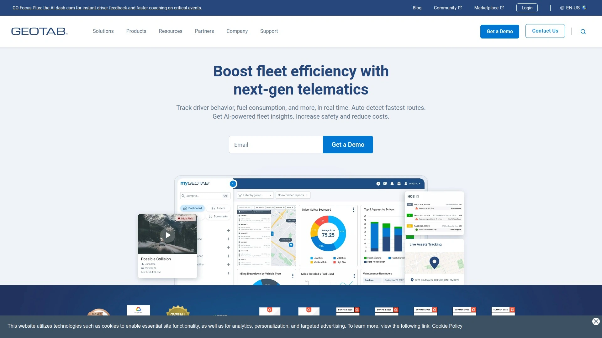

Geotab operates one of the largest connected vehicle platforms globally, equipping thousands of fleets with technology to automate, track, and manage optimized operations. GPS fleet tracking and management systems provide real-time visibility required to review incident footage, coach drivers, and mitigate risk. Cloud and IIoT technology deliver the infrastructure supporting data-intensive video telematics at scale.

Fleet dash cam solutions record HD videos, improve fleet safety, and eliminate guesswork around traffic violations. Tools for standardizing incident review help fleets build robust effective safety programs rather than reacting inconsistently to events. Coaching drivers consistently and tracking improvements over time becomes systematic rather than dependent on individual manager preferences.

**Broad compatibility and integration ecosystem:** Support for over 9,000 vehicle years, makes, and models including 300+ electric vehicles ensures Geotab works with diverse fleet compositions. This compatibility matters for organizations managing mixed fleets spanning multiple decades of vehicle purchases. The platform's open architecture enables third-party integrations through extensive API access and marketplace apps.

Video telematics combined with traditional GPS tracking and vehicle diagnostics create comprehensive data profiles for every vehicle and driver. This merged approach strengthens maintenance practices by correlating driving patterns with mechanical issues—harsh braking increases brake wear, excessive idling wastes fuel and strains engines. Early issue detection improves both asset maintenance and road safety.

Electric vehicle capabilities include battery health monitoring, range prediction, and charging station mapping—critical features for fleets transitioning from combustion engines. Sustainability reporting tracks carbon emissions reductions and documents environmental initiatives for corporate reporting. For enterprises requiring scalable telematics with proven reliability and extensive integration options, Geotab's established platform provides long-term stability.

## **[Azuga](https://www.azuga.com)**

Affordable fleet management software emphasizing ease of use and driver safety scores.

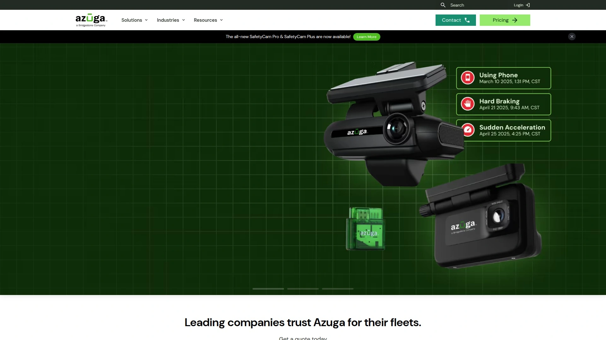

Azuga delivers fleet management systems working equally well for small businesses and enterprise fleets. The platform tracks every mile, every stop, every vehicle and driver alert from first ignition to final sign-out. This comprehensive monitoring analyzes and reports data to improve safety, accountability, and operational efficiency.

Safer driving behaviors, fewer accidents, better vehicle reliability, and optimized operations reduce expenses while increasing the number of customers you can serve daily. Driver safety scorecards motivate improvements through gamification—drivers see their scores compared to fleet averages and strive to rank higher. This competitive element often works better than punitive approaches for encouraging lasting behavior change.

**Simple implementation and flexible contracts:** Azuga Trackers install in minutes without professional installation services. This plug-and-play approach means less downtime for vehicles and minimal disruption to business operations. Coterminous contracts provide single renewal dates regardless when you add devices, simplifying administration. Add as many vehicles as needed without renegotiating terms—the system grows with your fleet.

Award-winning US-based support team sets up software and helps migrate information from previous systems. When problems arise or you need assistance, real people answer phones rather than routing you through automated systems. Real-time GPS tracking, vehicle diagnostics, and driver behavior monitoring integrate with Shopify, accounting software, and other business systems through APIs.

Maintenance tracking alerts managers when service is due based on actual mileage and engine hours rather than calendar schedules that waste money on premature maintenance or risk breakdowns from delayed service. For small to mid-sized commercial fleets working on limited budgets who need essential safety features without enterprise complexity, Azuga combines affordability with functional completeness.

## **[Zubie](https://zubie.com)**

Simplified telematics solution for straightforward fleet tracking and diagnostics.

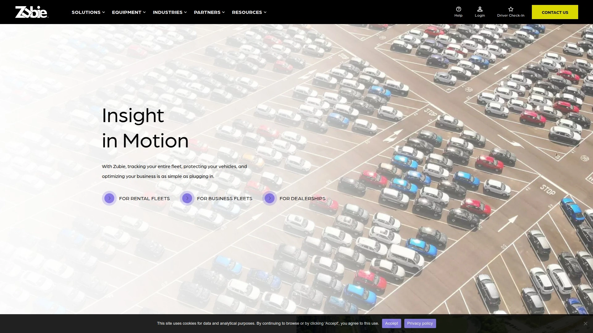

Zubie positions itself as all-in-one telematics for fleets needing to track, optimize, and streamline operations from single platforms. The simplified approach appeals to managers who don't need every advanced feature but require reliable basics done well. Real-time GPS tracking shows vehicle locations with historical route playback for verifying completed work.

Vehicle diagnostics pull data directly from engine control modules, alerting managers to check engine lights, low battery voltage, and maintenance needs before vehicles break down on job sites. This proactive monitoring prevents costly roadside repairs and keeps fleets running on schedule. Driver behavior monitoring tracks acceleration, braking, cornering, and speeding patterns—identifying risky drivers before they cause accidents.

**Integration partnerships and insurance programs:** Nationwide insurance partnered with Azuga and Zubie to offer telematics programs in New York, New Jersey, and Texas specifically for human services organizations. These insurance-linked programs provide premium discounts for fleets using telematics, directly offsetting implementation costs through lower insurance rates. Integration with insurance carriers simplifies claims processing when incidents occur.

Mobile apps let drivers and managers access information from smartphones, useful for field-based operations where employees rarely work from desks. Geofencing sets up virtual boundaries around customer locations, warehouses, or service areas—automatic notifications trigger when vehicles enter or exit zones. This location-based alerting verifies arrival times and departure times without requiring drivers to manually log activities.

The platform lacks some advanced features found in enterprise systems like Samsara or Verizon Connect, but many small fleets don't need those capabilities. For mid-size fleets in local service or logistics needing direct tracking and alert features without technical complexity, Zubie delivers functional solutions at accessible price points.

## **[Matrack](https://matrackinc.com)**

Multi-camera fleet dash cam with comprehensive AI-based driver monitoring.

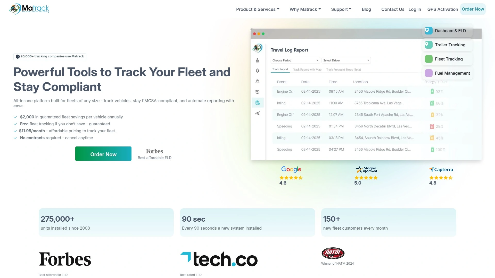

Matrack Fleet Dash Cam earned best overall rankings in 2025 testing because it combines AI-powered monitoring, GPS tracking, and instant alerts in accessible packages. Multi-view setup proves useful for tracking both road conditions and driver behavior across entire fleets, giving managers consistent evaluation methods linking driving habits with on-road events. Support for up to five cameras—front, rear, side, and driver-facing—provides comprehensive coverage eliminating blind spots.

AI features significantly improve accountability by flagging risky actions like harsh braking, drowsiness, and phone use in real time. Event footage automatically stores in the cloud, giving fleet operators reliable evidence for training, compliance reporting, and insurance claims. On-demand video access streamlines accident investigations and saves time when comparing incidents across different vehicles and time periods.

**Three-step deployment and remote monitoring:** Registration, installation, and ADAS calibration complete through simple three-step processes. This simplified setup contrasts with competitors requiring professional installation taking vehicles out of service for half days. You can remotely monitor any camera connected to the dashcam system, useful for checking on vehicles without calling drivers and interrupting their work.

AI alerts detect drowsiness, texting, lane drifting, and other dangerous behaviors, warning drivers immediately so they can self-correct. Real-time location tracking through integrated GPS shows where every vehicle operates at any moment. The device provides evidence against false claims, efficiently exonerating drivers when other parties lie about accident circumstances.

Drawbacks include slower live video access in poor network zones, which challenges fleets running long routes through rural areas with spotty cellular coverage. Higher initial costs due to multi-camera setups and optimal functionality requiring stable internet connections may limit appeal for budget-conscious operations in remote regions. For fleets prioritizing comprehensive visual coverage and AI-powered safety features, Matrack's multi-camera approach delivers thorough monitoring capabilities.

## FAQ

**How do fleet dash cams actually reduce accident costs and insurance claims?**

Video evidence settles liability disputes immediately rather than dragging through months of investigation. When your driver isn't at fault, HD footage proves it to insurance companies within hours—Samsara customers saved $225 million defending against false claims using dashcam video. AI detection of risky behaviors like phone use, drowsiness, and harsh braking lets you coach drivers before accidents happen, reducing collision rates by 80% or more at companies implementing proactive programs.

**Do drivers resist having cameras in their vehicles or does it hurt recruitment?**

Initial resistance is common, but companies using positive reinforcement systems like Netradyne's GreenZone scores or Motive's safety programs report driver acceptance improves quickly. Highlighting that cameras protect drivers from false accusations rather than just monitoring mistakes changes the narrative. Privacy modes disabling driver-facing cameras during breaks and visible recording indicators showing when cameras are active address major privacy concerns. Drivers appreciate exoneration from not-at-fault accidents more than they dislike being recorded.

**What's the actual cost difference between basic GPS tracking and full video telematics systems?**

Basic GPS tracking starts around $14-40 monthly per vehicle with simple location monitoring and geofencing. Full video telematics with AI safety features typically runs $40-100+ monthly per vehicle depending on camera configurations, storage duration, and platform features. However, fleets implementing video systems often recover costs within months through reduced insurance premiums, faster claim resolution, and fewer at-fault accidents. One customer reported claims losses dropping 80%, reducing weekly incident calls to one monthly call—savings that dwarf subscription costs.

## Conclusion

The fleet dash cam market has matured beyond basic recording—modern platforms use AI to prevent accidents before they happen while providing ironclad evidence when incidents occur. Whether managing local service vehicles or interstate trucking operations, these systems deliver measurable safety improvements and cost reductions through automated coaching, instant video access, and comprehensive GPS tracking. [SureCam](https://surecam.com) stands out for commercial fleets who want AI-powered safety without overwhelming complexity—the platform's intelligent alert filtering, automatic driver identification, and real-time video streaming deliver professional-grade fleet visibility without requiring IT departments to manage. For operations prioritizing practical results over feature checklists, SureCam's focused approach makes fleet safety genuinely manageable.
